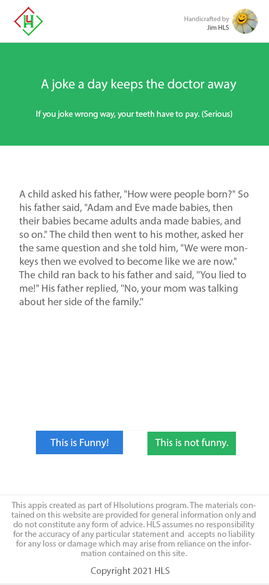
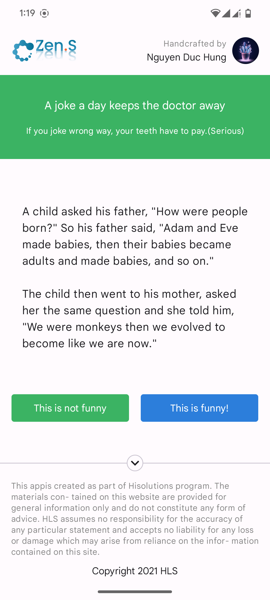
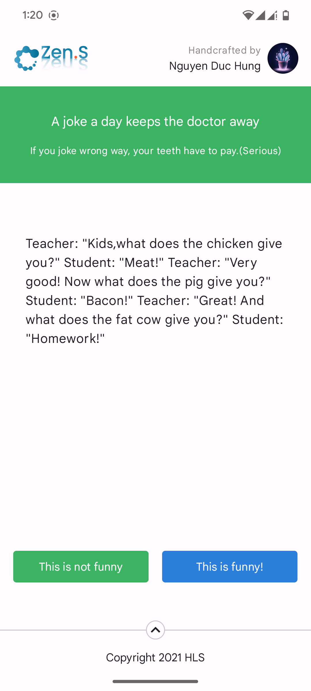
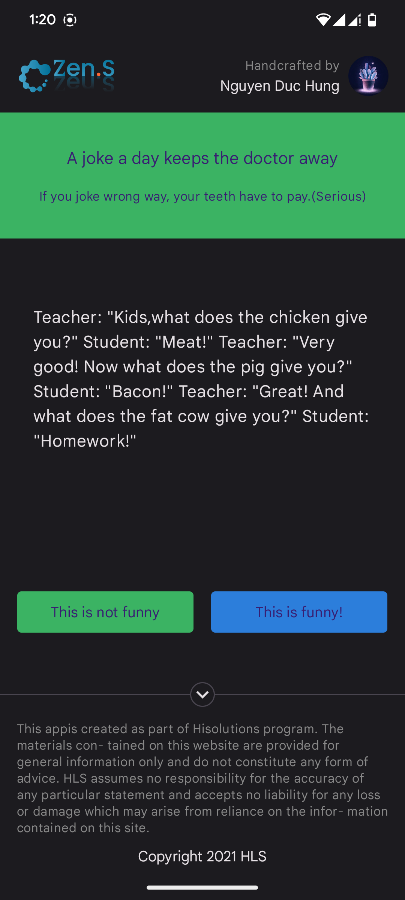
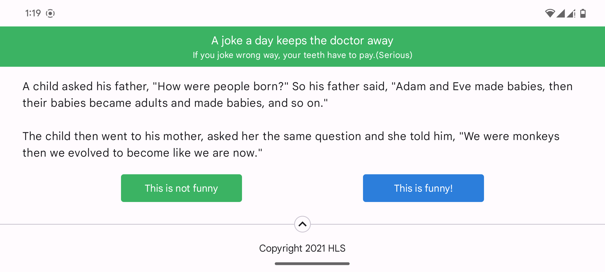
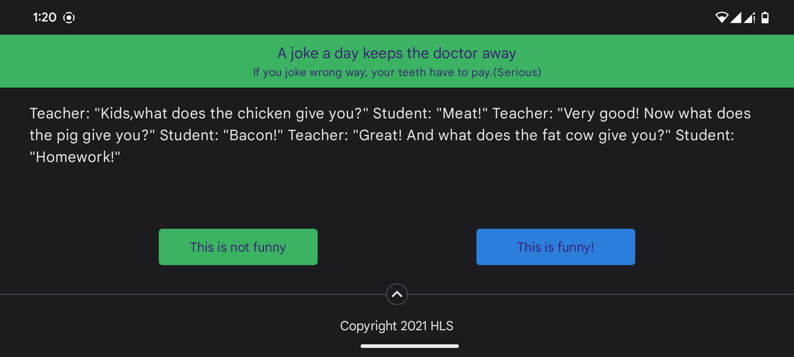

# Jokee-Single-Serving

A Kotlin native app to create a single serving APP that displays jokes for user to vote.

## Requirements

This app will display a single joke for the user to read.
After reading the joke, the user will like or dislike the joke.
The app will record the vote in database and then show another joke for the user to read.
When there is no more jokes to show, the app will display
a `"That's all the jokes for today! Come back another day!"` message.

There is no need to display the result of the votes.
User should not see the same joke twice.
User do not need to register or login to view the joke or vote for the joke.

## Features

### Architecture

- Clean Architecture with MVVM and Repository pattern.
    - UI layer interact with Data layer through repository interface
    - Dependency Injection with Hilt
- Unidirectional data flow (events flow down, data flow up)
- Reactive programming
    - ViewModel (view state holder) reactive with data from repository.
    - Repository reactive with database changes

### UI Layer

- A splash screen with animation waiting for the data init done.
- Support for vertical and horizontal layout (when rotate screen on phone).
- Basic dark mode.
- Scrollable joke content and expandable copyright content.
- Draw content behind system bars

### Date Layer

- Cache user preferences as an object, not only some key-value pairs
- Room persistence library provides an abstraction layer over SQLite
- Simulate long-running preload before enter joke screen

## Preview
https://github.com/nero240399/Jokee-Single-Serving/assets/50225603/d4c39368-6c73-4cfc-a91e-dc1b51d88614
|                                    |                                    |                                    |
|------------------------------------|------------------------------------|------------------------------------|
|  |  |  |
|  |
|  | 

